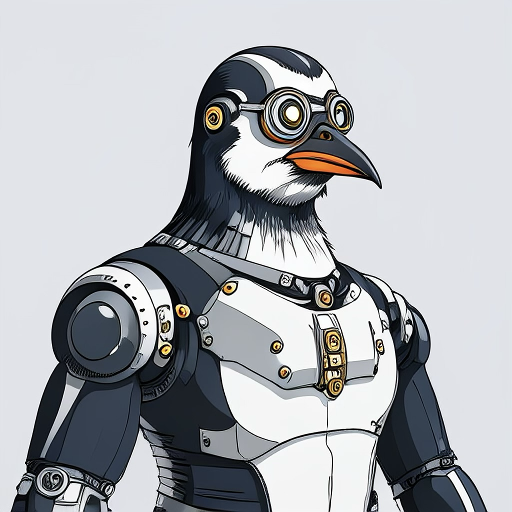
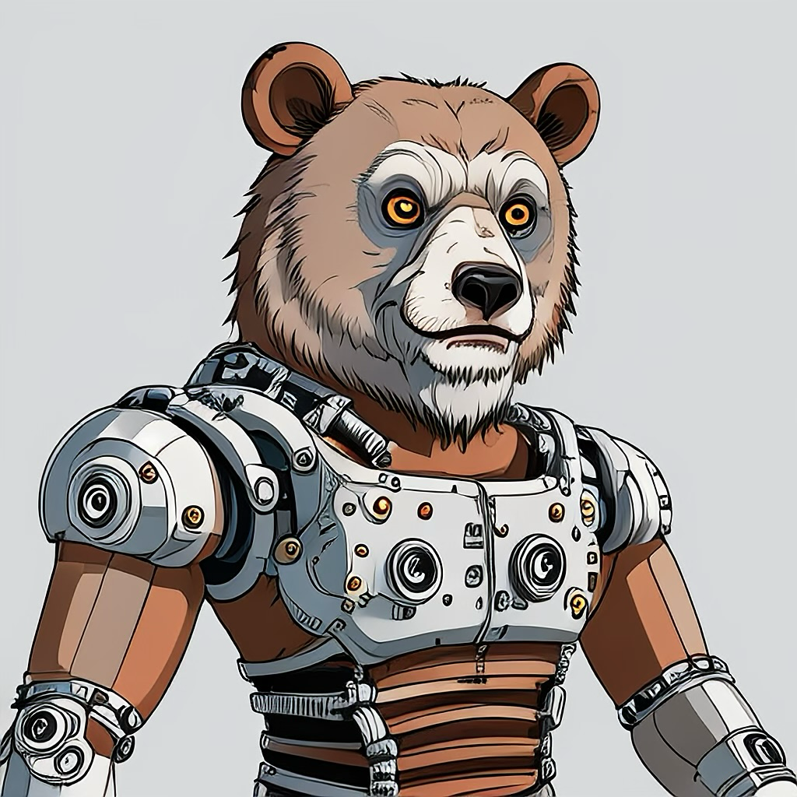

+++
date = '2025-04-27T18:47:24-04:00'
draft = false
title = 'About'
+++

## About Deuterium Labs

Welcome to Deuterium Labs!

We are a small indie game development studio focused on creating unique, cyberpunk/sci-fi inspired games.

Stay tuned for updates, projects, and development insights!

## Meet the Team

  
  
<strong>Nick</strong> – Code conjurer and caffeine-fueled penguin. Navigates neon codebases with icy precision.

  
  
<strong>Zach</strong> – Pixel architect and synthwave bear. Crafts worlds one glitch at a time.

